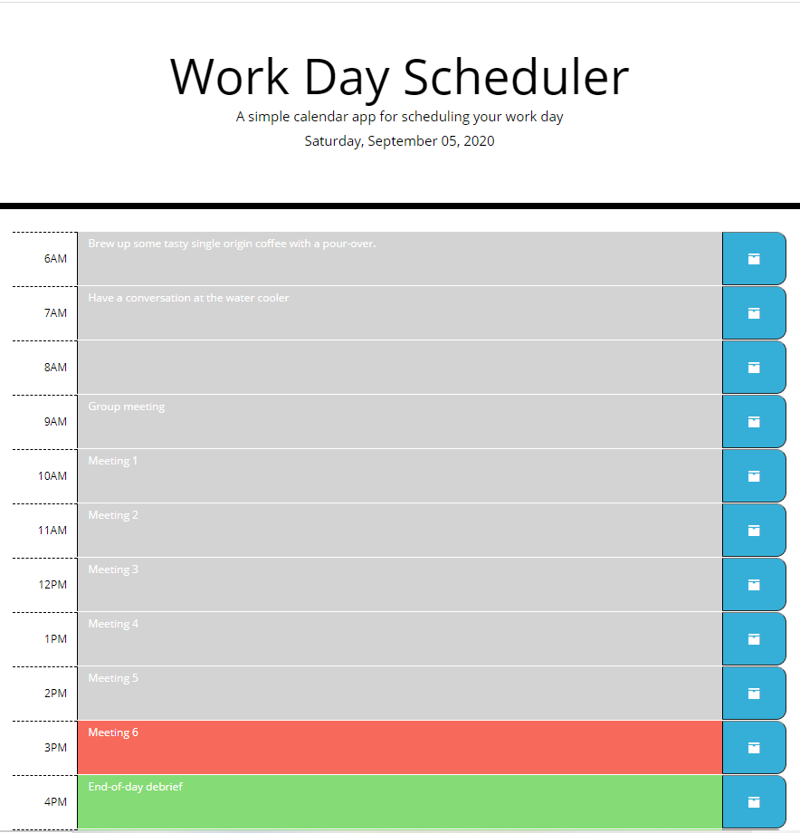

# Week 5 Challenge - Work Day Scheduler

## Table of Contents

* [Deployment](#deploy)
* [Description of Challenge](#description)
* [Execution of the Challenge](#execution)
* [Lessons Learned](#lessons)
* [More A-ha in the Future, aka Challenges to Get Over](#challenges)

## Deployment 

* The challenge is deployed at the following live URL:
https://plainjane99.github.io/Work_Day_Scheduler/

You should see the following:

* The application code for this challenge is located at the following GitHub repository:
https://github.com/plainjane99/Work_Day_Scheduler

## Description of Challenge 

The Week 5 Challenge for the UCLA Extension Full Stack Development Bootcamp was to create a "Work Day Scheduler" using Bootstrap and jQuery.  We were provided starter code that included the jumbotron, links to applicable stylesheets and applicable jQuery libraries in the HTML, as well as all of the CSS.  The goal was to add the core functionality to the .js file and to add the user interface with existing/new Bootstrap css to the .html file.  The acceptance criteria for this challenge included:  
* Display of the current day at the top of the calendar
* Display a calendar of hourly time blocks for standard business hours
* Ability to enter in events for each time block that will save to local storage via the click of a button
* Display a color-coded indication of time blocks in the past, present, or future

Once the acceptance criteria were met, the challenge was to be deployed to a live URL through GitHub and to have the webpage load with no errors.  

## Execution of the Challenge 

I started this challenge feeling quite overwhelmed and confused, but have now completed the challenge feeling that I have learned a lot.  This challenge comes immediately after learning about event handlers for vanilla Javascript which I did not have a good handle on.  My first troubles began with mixing Javascript vs jQuery syntax.  It was difficult to switch to jQuery at first, but luckily, I was able to meet with my tutor, who helped clear up some of the confusion.  Once I had that ah-ha moment, writing the code became much easier.  

There were a lot of lessons learned from this challenge that I will describe in the next section.  Some of the application-specific nuances from executing this challenge include:

* The time-block calendar utilizes Bootstrap grid and respective Bootstrap styling to create a three-column row.  The row is split into 1-10-1 width columns to allow the calendar to shrink nicely as the screen gets smaller.  The Bootstrap styling was really easy to apply to manipulate the look of the time blocks.

* Icons:  I was unable to find a "save" icon in the <useiconic.com/open> site so I used the "box" icon for the "save" button.

* Starter Code CSS:  I added comments to all of the starter code CSS to help me keep track of which selectors were used where as I inserted them into the html.  However, there were two selectors in the starter code CSS that I could not tell what they were meant for.  For example, the selector called "time-block" creates a border-radius of 15px but the mock up animation does not show any other features that require a border-radius, other than the "save" button which had its own selector.  I chose to comment out the two selectors since they were not used and still resulted in a layout representative of the mock-up.

* Script.js:  There is opportunity in my script.js file to refactor the code.  In my attempt to gain an understanding of event handling via jQuery, I ended up writing out the code for each time block separately.  Upon completion of this README, I will try to refactor the code.  If my attempt is successful, the code will be pushed to GitHub.

## Lessons Learned 

The two main lessons learned from this challenge are 1. how to use jQuery event handling and, adjacently, how to use vanilla Javascript event handling, and 2. how to write simpler functions.

1. As mentioned in the Execution section of this README, I started this challenge out with a very poor understanding of how to use event handling.  I understood the basic concept, but actually putting it into code is much more difficult.  I am starting to understand that the key is to provide uniqueness to the structure of the html through ID's and attributes, and therefore names to the containers of the data, to allow Javascript to pull specific information.  I will keep this in mind going-forward so that it is more intuitive and automatic to apply ID's and specificity to the data.

2. When working the challenge, I often refer to the code written for the at-home Lesson, which I have learned must be taken with a grain of salt.  As I was getting the most confused with event handling and writing functions, my tutor talked me through what the code needed to do versus what I was actually writing.  He helped me become aware that I was taking the long way around to get from point A to point B.  I feel that writing good functions will be one of the most important aspects of code that I will slowly improve on as I gain more experience through this course.  

3. One other lesson-learned that I feel deserves mention again is the use of Chrome Developer Tools.  Just when I thought I had a good grasp of the Dev Tool, I was once again surprised with what I learned this week.  This week, the Dev Tool was essential in helping me understand the event handling and how to write formulas.  I used the Console tab to test single lines of code before implementing it into my javascript.  The lessons material demonstrate the use of console.log, but it wasn't until this challenge that doing so was essential to completing the assignment.  I also used the Elements tab to work out the CSS for this challenge.  Awesome tool!

## More A-ha in the Future, aka Challenges to Get Over 

The challenges I know I have ahead of me include:
1. Event Handling - There is very likely a better way to use Event Handling for this Challenge.  I believe my code demonstrates a basic understanding and not yet the "experienced" understanding of event handling.
2. Functions - Functions come very piece-meal for me so I believe there is still much to be learned on how to write a good function that takes a direct route rather than one that traverses multiple other points before arriving at the result.  

Thanks for reading this README.md.